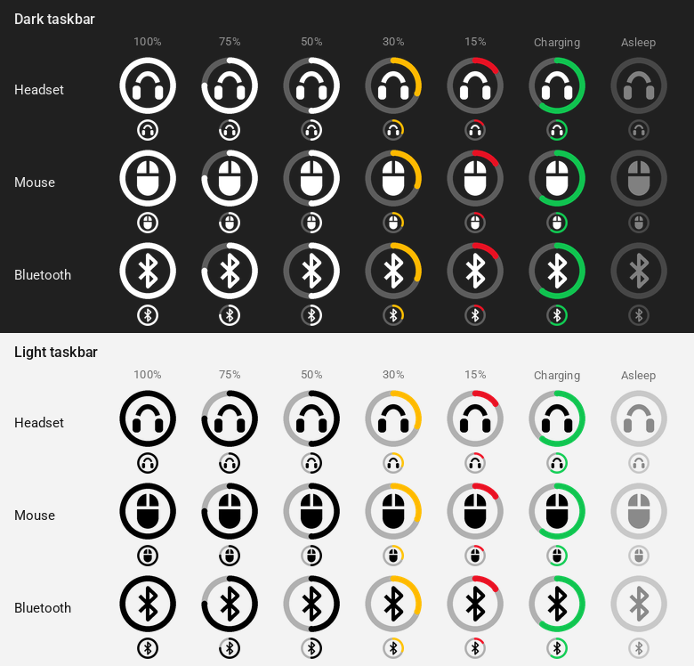
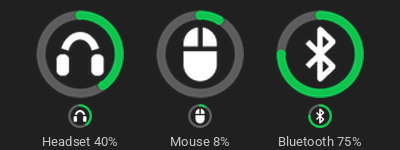

# Halo Battery

Shows the battery level of wireless devices in the Windows system tray. Each device gets its own icon: a battery ring with the device pictogram in the middle. No Synapse or other vendor software required.

While charging, the arc slowly "breathes":

## Supported devices

Tested on real hardware:

| Device | Connection | How the battery is read |
|---|---|---|
| Razer BlackShark V2 Pro (2023) | 2.4 GHz receiver (1532:0555) | The headset's own "PA" protocol: output reports 0x02 on the vendor interface 0xFF00, remote mode 0xE1, commands 0x21 (battery) and 0x2A (charging) |
| WLmouse Beast X Max | 8K receiver (36A7:A880) and USB cable | Feature request `02 02 00 83`; if there is no reply, the mouse heartbeat is used. Receiver and cable share one icon |
| Bluetooth devices, tested on the 1MORE SonoFlow headset | Bluetooth (enable in the menu) | The level Windows itself knows (`DEVPKEY_Bluetooth_Battery`). Only devices connected right now are shown: the link state comes from WinRT (`BluetoothDevice.ConnectionStatus`, the same source as Windows Settings) |

Support for other devices is not guaranteed. The code already includes protocols for some other Razer and WLmouse models and works with any Bluetooth device whose battery level Windows reports, but these have not been tested. New devices are added based on feedback and diagnostics logs: if yours is not detected or shows a wrong level, open an issue and attach the diagnostics report (see [Troubleshooting](#troubleshooting)).

## Installation

### Option 1: ready-made .exe (recommended)

1. Download `HaloBattery.exe` from the [Releases](../../releases/latest) page.
2. Put it somewhere permanent, e.g. `C:\Tools\HaloBattery\HaloBattery.exe`, and run it.
3. Right-click the tray icon → **Start with Windows**.

No Python or other dependencies required. Windows SmartScreen may warn about an unrecognized app on first launch, because the file is not code-signed: click **More info → Run anyway**.

### Option 2: from source

1. Install [Python 3.10+](https://www.python.org/downloads/) with **Add python.exe to PATH** checked.
2. Download or clone this repository somewhere permanent, e.g. `C:\Tools\HaloBattery`.
3. Run `install_and_run.bat`.
4. Right-click the tray icon → **Start with Windows**.

To build the .exe yourself, run `build_exe.bat`; the result is `dist\HaloBattery.exe`.

Releases are built automatically: pushing a tag like `v1.8.0` makes GitHub Actions build `HaloBattery.exe` on Windows and attach it to the release (see `.github/workflows/release.yml`).

## The icon

The icon is a battery ring with the device pictogram in the middle. The arc fills clockwise from the top.

- Centre: a headset, a mouse or the Bluetooth rune. The pictogram can be turned off in the menu.
- Normal arc uses the taskbar colour: white on a dark taskbar, black on a light one.
- Amber arc: the level is close to the alert threshold. Red: at or below it.
- Green arc that slowly "breathes": charging. The animation can be turned off in the menu, leaving a plain green arc.
- Translucent icon without an arc: the device is asleep or off.

Hover over the icon to see the exact percentage. The low battery notification fires once and only again after the device has been charged.

## Tray menu

- **Refresh now**, **Poll interval** (15 s to 5 min), **Low battery alert at** (off, 10–30%)
- **Windows Bluetooth devices**, **Device pictogram**, **Charging animation**
- **Start with Windows** (per-user registry key, no admin rights needed)
- **Diagnostics…**: writes a detailed report and opens it

## Troubleshooting

1. Close Synapse, the WLmouse web driver and other battery tools: they may hold the receiver.
2. Wake the mouse up by moving it.
3. Run `probe.bat` or choose **Diagnostics…** from the tray menu. The report lists every HID device and the raw protocol replies. Attach it to an issue in this repository to get a new device supported. The report contains Bluetooth MAC addresses and device serial numbers; you may want to redact them before posting.

Settings, the log and the diagnostics report live in `%APPDATA%\HaloBattery`.

## Credits

The WLmouse protocol was reverse-engineered by @len0c ([incconutwo/mouse-battery-tray](https://github.com/incconutwo/mouse-battery-tray), MIT). The BlackShark V2 Pro 2023 protocol comes from the OpenRazer driver ([PR #2862](https://github.com/openrazer/openrazer/pull/2862)). Razer PIDs and transaction IDs come from OpenRazer and [RazerBatteryTaskbar](https://github.com/Tekk-Know/RazerBatteryTaskbar).

## License

MIT, see [LICENSE](LICENSE).
